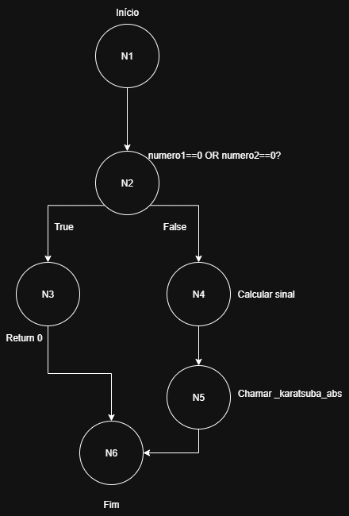
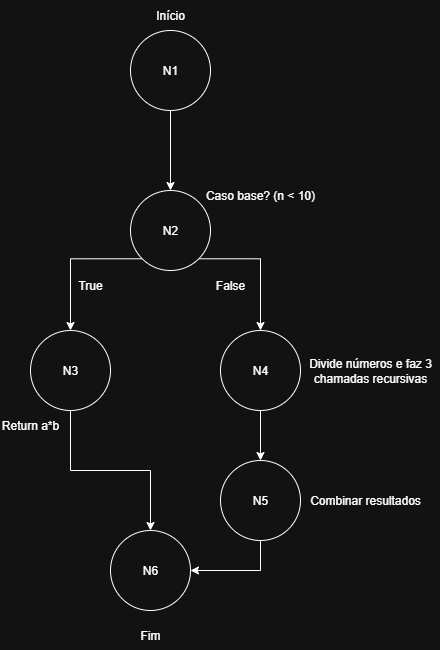

# Projeto Karatsuba

## Sobre o Projeto

O **Karatsuba** é um projeto educativo desenvolvido para implementar e testar o **algoritmo de multiplicação de Karatsuba**, um método mais eficiente para multiplicar números grandes em comparação com a multiplicação tradicional de escola (método “long multiplication”).  

Esse algoritmo reduz o número de multiplicações necessárias dividindo os números em partes e aplicando recursivamente o mesmo processo, alcançando uma complexidade assintótica de aproximadamente **O(n^log₂3) ≈ O(n^1,585)**.  

No projeto, temos dois arquivos principais:

### Arquivo `app.py`

Contém a implementação do algoritmo:
- **`karatsuba(numero1, numero2)`**  
  Função principal que trata números positivos ou negativos. Ela define o sinal do resultado e chama a função recursiva apenas com valores absolutos.  
- **`_karatsuba_abs(numero1, numero2)`**  
  Implementa o algoritmo de forma recursiva:  
  1. **Caso base:** Se um dos números tiver apenas um dígito, retorna a multiplicação direta.  
  2. **Divisão:** Divide cada número em duas partes (alta e baixa).  
  3. **Recursão:** Calcula três produtos:  
     - Produto das partes baixas.  
     - Produto das partes altas.  
     - Produto das somas das partes (termo cruzado).  
  4. **Combinação:** Reconstrói o resultado usando potências de 10 e a fórmula de Karatsuba.  

### Arquivo `main.py`

Contém a interface interativa para o usuário:
- **`ler_inteiro(mensagem)`** → Lê e valida números inteiros digitados pelo usuário.  
- **`multiplicar_manual()`** → Permite inserir dois números manualmente, aplica o algoritmo e mostra o tempo de execução.  
- **`rodar_testes()`** → Executa um conjunto de testes prontos, exibindo resultados, valores esperados e tempos.  
- **`menu()`** → Exibe o menu principal do programa e chama as funções acima.  

Assim, o usuário pode **escolher entre multiplicar manualmente ou rodar testes automáticos**.

---

## Como executar o projeto

### Pré-requisitos

- **Python 3.10 ou superior** instalado na máquina.  
- O projeto não utiliza nenhuma biblioteca externa além da padrão do Python.

### Passo 1: Clonar ou copiar o projeto

Coloque os arquivos `app.py` e `main.py` na mesma pasta.

### Passo 2: Executar o programa

No terminal, navegue até a pasta do projeto e execute:

```bash
python main.py
```

### Passo 3: Usar o menu
Ao rodar o script, será exibido o menu interativo:
```
==========================================
   Algoritmo de Karatsuba - Menu
==========================================
[1] Multiplicar manualmente
[2] Rodar testes prontos (com detalhes)
[0] Sair
Escolha uma opção: 
```

---

## Relatório Técnico — Complexidade Ciclomática

A complexidade ciclomática mede a quantidade de caminhos independentes no código.  
A fórmula utilizada é:
\[
M = E - N + 2P
\]
onde:  
- **E**: número de arestas do grafo de fluxo de controle  
- **N**: número de nós do grafo  
- **P**: número de componentes conexos (para uma função isolada, **P = 1**)

> Observação: nesta análise, consideramos cada **decisão** de fluxo como um ponto de bifurcação (e.g., `if`, condição booleana em expressão condicional). Instruções sequenciais (atribuições/cálculos) não adicionam bifurcações.

---

### 1) Função `karatsuba(numero1, numero2)`

#### 1.1. Fluxo de controle (passo a passo)

1. **Início** da função.  
2. **Verifica** se algum número é zero (`if numero1 == 0 or numero2 == 0`).  
   - Se **verdadeiro**: **retorna 0**.  
   - Se **falso**: segue.  
3. **Calcula** `sinal` usando expressão condicional: `-1 if (numero1 < 0) ^ (numero2 < 0) else 1`.  
4. **Chama** `_karatsuba_abs` com valores absolutos e **retorna** `sinal * resultado`.

#### 1.2. Grafo de fluxo

**Nós (N):**
1. **N1**: Início da função.  
2. **N2**: Decisão “algum é zero?” (`if ... or ...`).  
3. **N3**: Retorno imediato `return 0` (ramo verdadeiro).  
4. **N4**: Decisão da expressão condicional para `sinal` (XOR).  
5. **N5**: Retorno final (`return sinal * _karatsuba_abs(...)`).  
6. **N6**: Fim da função.

> Total de nós: **N = 6**

**Arestas (E):**
1. **N1 → N2**: do início para a verificação do `if`.  
2. **N2 (V) → N3**: condição verdadeira (algum é zero) vai ao retorno imediato.  
3. **N2 (F) → N4**: condição falsa segue para decidir `sinal`.  
4. **N4 (True) → N5**: `sinal = -1` segue para o retorno final.  
5. **N4 (False) → N5**: `sinal = 1` segue para o retorno final.  
6. **N3 → N6**: retorno imediato até o fim.  
7. **N5 → N6**: retorno final até o fim.

> Total de arestas: **E = 7**

**Componentes conexos:** **P = 1**

#### 1.3. Cálculo

M = E - N + 2P = 7 - 6 + 2P = 3

**Interpretação:** Há **3** caminhos logicamente independentes:  
- Ramo que retorna 0 (algum fator é zero).  
- Ramo que calcula `sinal = -1` e retorna.  
- Ramo que calcula `sinal = 1` e retorna.

---

### 2) Função `_karatsuba_abs(numero1, numero2)`

#### 2.1. Fluxo de controle (passo a passo)

1. **Início** da função.  
2. **Verifica** caso base: números “pequenos” (`if numero1 < 10 or numero2 < 10`).  
   - Se **verdadeiro**: **retorna** a multiplicação direta.  
   - Se **falso**: segue.  
3. **Divide** os números em partes alta/baixa e **realiza três chamadas recursivas**  
   (`produto_baixas`, `produto_altas`, `produto_cruzado`).  
4. **Combina** os resultados e **retorna** o valor final.

> Observação: as três chamadas recursivas **não** criam bifurcações de fluxo dentro desta função; elas são chamadas sequenciais cujo resultado converge para um único `return`.

#### 2.2. Grafo de fluxo

**Nós (N):**
1. **N1**: Início da função.  
2. **N2**: Decisão do caso base (`if ... or ...`).  
3. **N3**: Retorno base (multiplicação direta).  
4. **N4**: Bloco de cálculo Karatsuba (divisão em partes + 3 chamadas recursivas).  
5. **N5**: Retorno final com a combinação dos termos.  
6. **N6**: Fim da função.

> Total de nós: **N = 6**

**Arestas (E):**
1. **N1 → N2**: do início para o `if` do caso base.  
2. **N2 (V) → N3**: caso base verdadeiro retorna direto.  
3. **N2 (F) → N4**: caso base falso segue para cálculos/recursões.  
4. **N4 → N5**: após cálculos, vai para o retorno final.  
5. **N3 → N6**: retorno base até o fim.  
6. **N5 → N6**: retorno final até o fim.

> Total de arestas: **E = 6**

**Componentes conexos:** **P = 1**

#### 2.3. Cálculo

M = E - N + 2P = 6 - 6 + 2P = 2


**Interpretação:** Há **2** caminhos independentes:  
- Caminho do **caso base** (retorno direto).  
- Caminho do **caso recursivo** (divide, calcula três produtos, combina e retorna).

---

### 3) Síntese

- `karatsuba(...)` → **M = 3**  
- `_karatsuba_abs(...)` → **M = 2**

A implementação mantém a complexidade de controle **baixa** e legível, isolando as decisões principais (tratamento de zeros/negativos e caso base) e concentrando a “complexidade algorítmica” no **cálculo recursivo** (que impacta a complexidade de tempo, não a ciclomática).

## Análise da Complexidade Assintótica

Considere **n** como o número de dígitos (em base 10) do maior entre `numero1` e `numero2` na chamada a `_karatsuba_abs`.  
O algoritmo divide os inteiros ao meio, realiza 3 multiplicações recursivas de tamanho aproximado `n/2` e faz operações lineares (somas e “shifts” por potências de 10).

### 1) Complexidade Temporal

Recorrência: `T(n) = 3*T(n/2) + O(n)`  
Pelo Teorema Mestre: `T(n) = Θ(n^(log2(3))) ≈ Θ(n^1.585)`

- O termo `O(n)` vem das somas `(a_alta + a_baixa)`, `(b_alta + b_baixa)` e da combinação final com potências de 10.
- A profundidade da recursão é `Θ(log n)`, pois a cada nível o tamanho é dividido por 2.

**Casos por entrada:**

| Caso        | Condição (entrada)                                                       | Tempo                     |
|-------------|--------------------------------------------------------------------------|---------------------------|
| Melhor      | Algum fator é `0` (curto-circuito em `karatsuba`) **ou** `n <= 1`        | `Θ(1)`                    |
| Médio       | Inteiros arbitrários com `n` dígitos                                     | `Θ(n^(log2(3)))`          |
| Pior        | Inteiros “grandes” (sem curto-circuito), percorrendo toda a recursão     | `Θ(n^(log2(3)))`          |

Observação: para entradas do mesmo tamanho `n`, Karatsuba sempre faz 3 submultiplicações; assim, **médio** e **pior caso** coincidem em ordem assintótica.

### 2) Complexidade Espacial

- **Pilha de recursão:** profundidade `Θ(log n)` frames.
- **Memória temporária por nível:** inteiros temporários com até `O(n)` dígitos (produtos e somas no nível corrente).

Como os temporários “grandes” existem principalmente no nível corrente (e são liberados ao retornar), o pico de memória auxiliar é dominado por um nível:

- Espaço auxiliar total (desconsiderando entrada/saída): `Θ(n)`
- Espaço de pilha: `Θ(log n)`

**Resumo**
- **Tempo:** `Θ(n^(log2(3))) ≈ Θ(n^1.585)` (médio e pior) e `Θ(1)` (melhor com curto-circuito/caso base).
- **Espaço:** `Θ(n)` auxiliar + `Θ(log n)` de pilha (médio e pior); `Θ(1)` no melhor caso.

## Grafo de Fluxo - Função karatsuba

<p align="center">
  
</p>


## Grafo de Fluxo - Função _karatsuba_abs

<p align="center">
  
</p>
